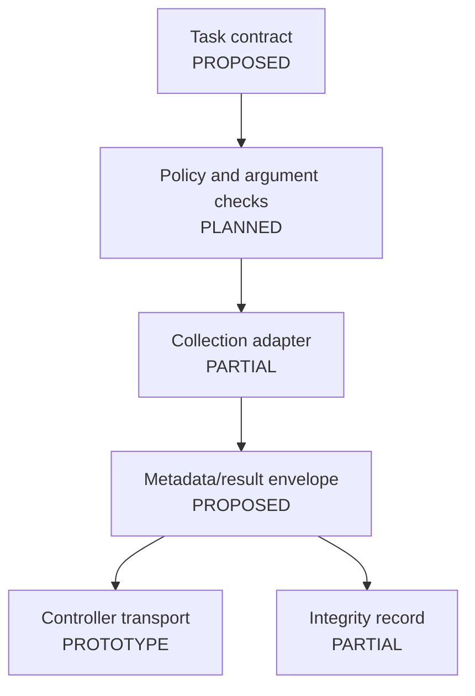

# Agent Architecture

Native collectors under `execution_engine/forensics/` and the Python modules
under `forensic_primitives/` do not currently form one complete adapter API.
The transport router's command dispatch is explicitly a hook.