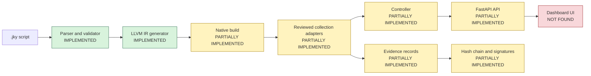
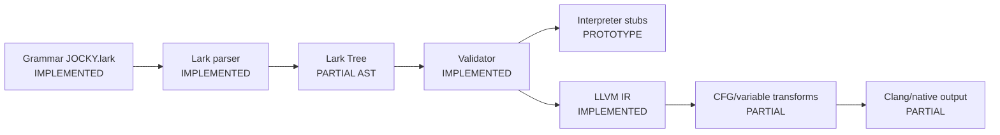
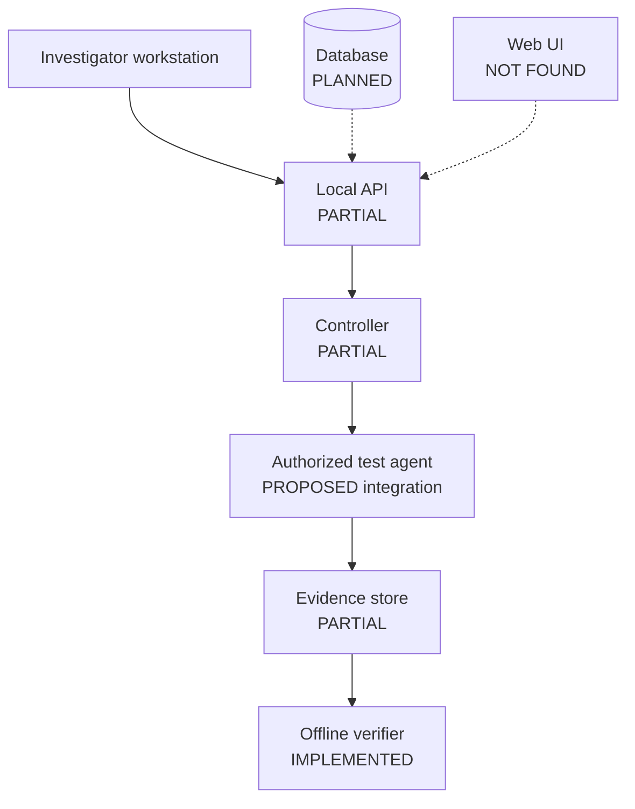

# Architecture

## High-level architecture

## Layers

| Layer | Purpose | Inputs / outputs | Status |
|---|---|---|---|
| Language | Define case and operations | `.jky` -> tokens/tree | IMPLEMENTED |
| Compiler | Validate and emit IR | parse tree -> `.ll` | IMPLEMENTED |
| Runtime/agent | Execute authorized collection | task -> result | PARTIALLY IMPLEMENTED |
| Controller | Track agents and tasks | registrations/tasks -> state/results | PARTIALLY IMPLEMENTED |
| Communication | Deliver check-ins/results | encrypted message -> response | PROTOTYPE |
| Evidence | Collect system artifacts | adapter -> result metadata | PARTIALLY IMPLEMENTED |
| Integrity | Chain and sign events | event -> JSONL entry | PARTIALLY IMPLEMENTED |
| Backend | Serve management operations | HTTP -> controller | PARTIALLY IMPLEMENTED |
| Dashboard | Present status and evidence | API -> UI | NOT FOUND |

## Compiler pipeline

## Agent and controller

The controller has `AgentState`, `AgentTask`, `AgentSession`, queues, polling, callbacks, and result retention. The transport has retry and circuit-breaker code. The command-to-collection dispatch hook remains unfinished, so the runtime is not an end-to-end agent.

## Deployment concept

The deployment diagram is a target architecture, not an operational deployment instruction.