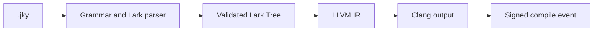

# Compiler Overview

The compiler path is the most complete part of JOCKY:

`main.py` wires parsing, validation, IR generation, optional transformations,
native compilation, and integrity recording. The parser and validator are
implemented; the dedicated AST and interpreter remain incomplete.