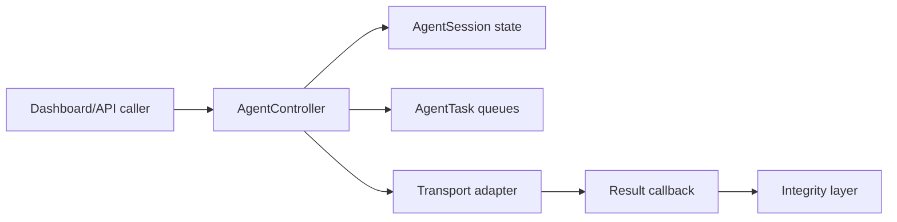

# Controller Architecture

The state model includes pending, connected, tasked, collecting, idle, lost,
and terminated states. The controller stores results in memory with a bounded
retention count. It does not provide durable recovery or access control.