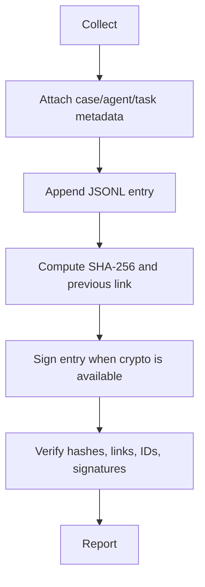

# Data Flow

```mermaid
flowchart LR
  S[Case script] --> T[Parse tree]
  T --> V[Validated tree]
  V --> R[LLVM IR]
  R --> N[Native artifact]
  N --> X[Collection result]
  X --> M[Metadata and task IDs]
  M --> H[SHA-256 chain entry]
  H --> G[Ed25519 signature]
  G --> Q[Verification report]
  Q --> API[API response]
```

The implemented compiler path carries case metadata into IR comments and the compile-chain payload. The intended evidence path carries result data into an agent-specific chain through the dashboard callback. It is not fully validated because remote dispatch and chain/API format consistency are incomplete.

## Evidence lifecycle

