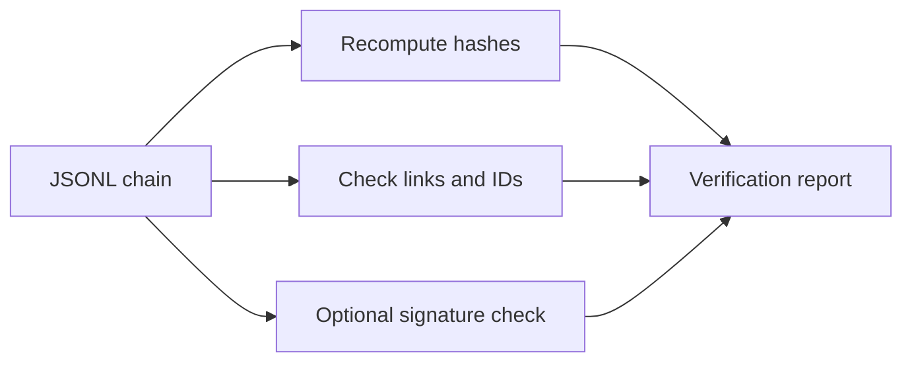

# Verification

The verifier recomputes each entry hash, checks the previous-entry link and
sequential ID, and optionally verifies an Ed25519 signature with a supplied
public key. It returns a boolean and human-readable report and has a CLI shape
that can be frozen with PyInstaller.

The verifier is an integrity check, not proof of correct collection, operator
identity, legal admissibility, or an unbroken chain of custody outside the
recorded file and key-management process.